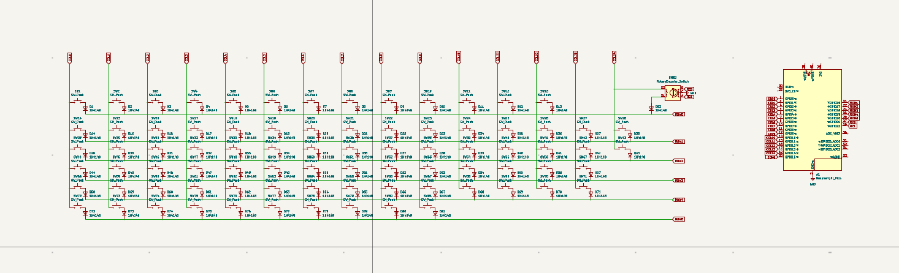
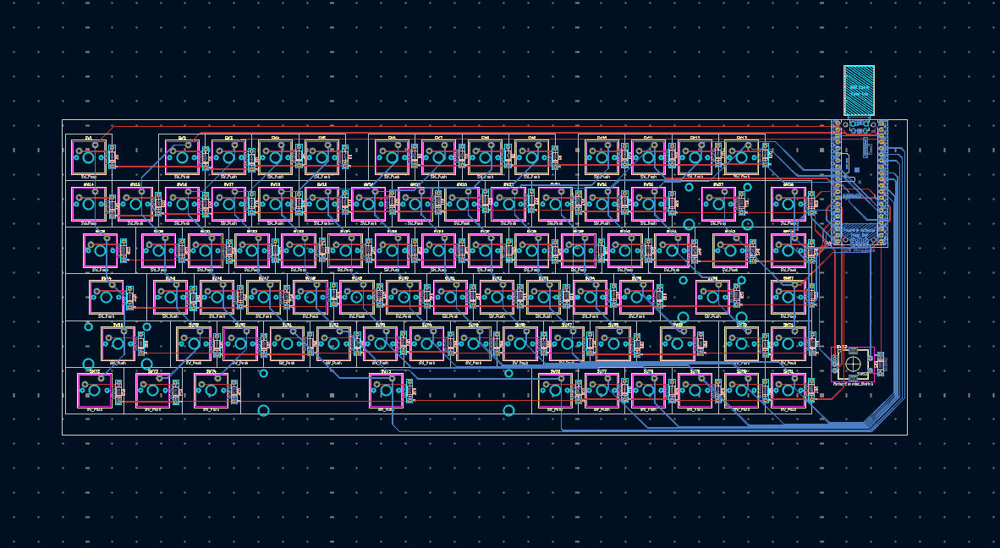
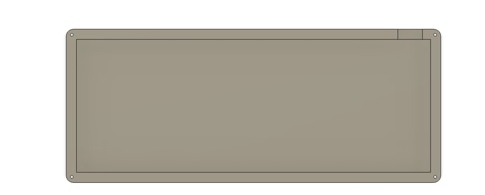
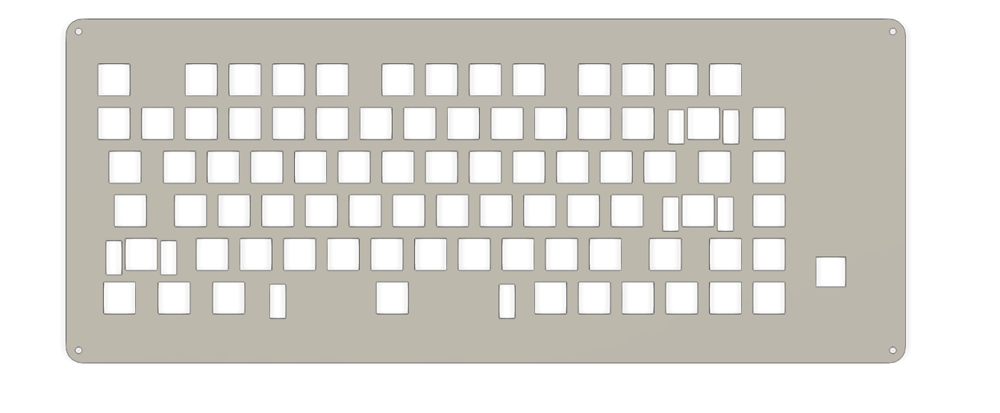
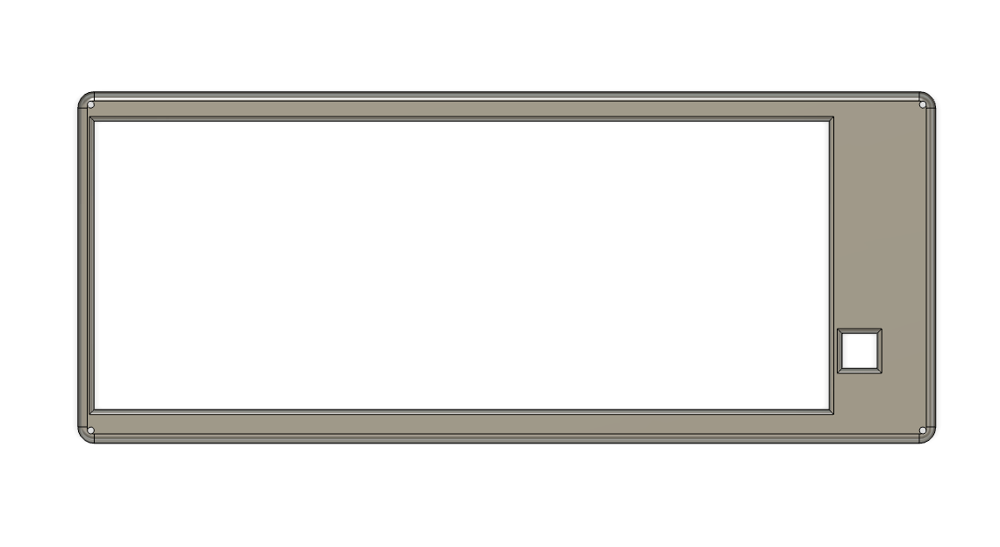
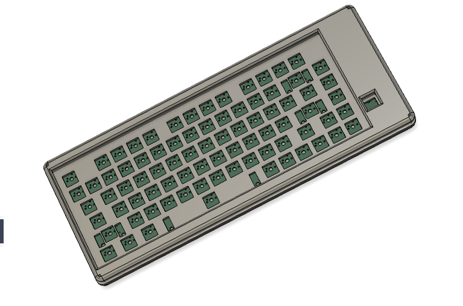

# Puli-s-Keyboard
I always wanted to get a keyboard but being a person who love making stuff on thier own instead of getting them so i started building the keyboard

i built the keyboard with 81 keys and a rotary encoder w a raspberrypi pico as the microcontroller and uses the open source  QMK firmware.It can also be called as a 78% Keyboard :))

## Schematics

## PCB

## CAD

## Assembly

## BOM

| Component | Purpose | Qty | Unit Cost ($) | Total ($) | Link | Distributor |
|----------|--------|-----|--------------|-----------|------|------------|
| USB A Type to Micro USB B Cable | cable | 1 | 4.24 | 4.24 | https://robu.in/product/usb-a-to-micro-usb-cable/?variant_id=392404020725 | Robu |
| Screws M2 | connectors | 4 | 0.81 | 3.24 | https://robu.in/product/m2x4-flat-head-screw/?variant_id=3647235850646 | Robu |
| Raspberry Pi Pico | microcontroller | 1 | 4.21 | 4.21 | https://robu.in/product/raspberry-pi-pico/?variant_id=3920405566007 | Robu |
| 4x10 Enkeysphere Cherry Profile PBT Keycaps | keycaps | 1 | 21.17 | 21.17 | https://stackskb.com/collections/keycaps/products/4x10-enkeysphere-cherry-profile-pbt-keycaps | StacksKB |
| Switches (Akko Creamy Cyan) | keys | 40 | 0.37 | 14.80 | https://stackskb.com/products/akko-creamy-cyan-switch-pack-of-45-pre-order | StacksKB |
